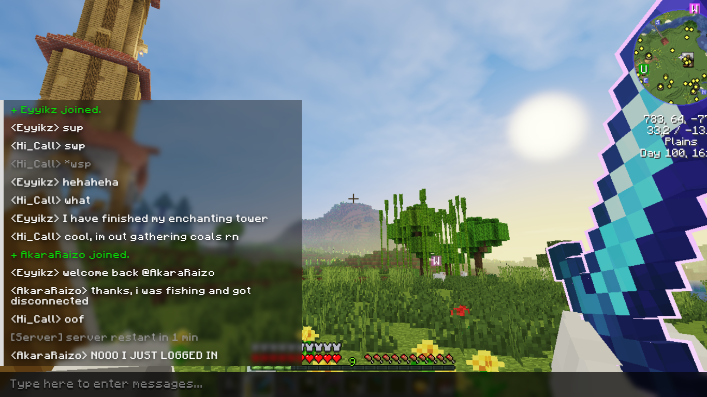
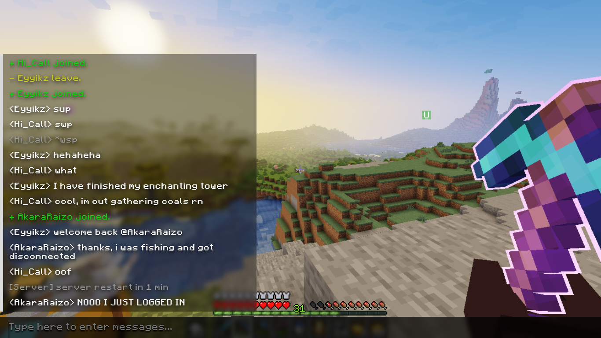
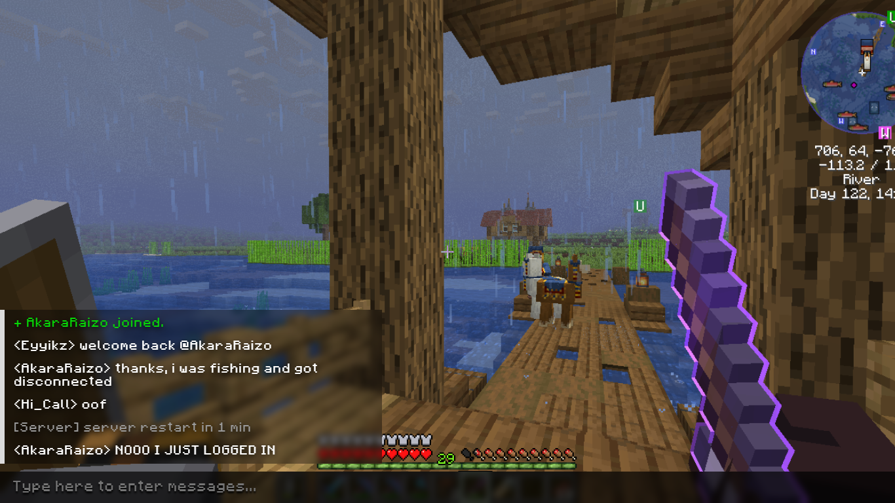
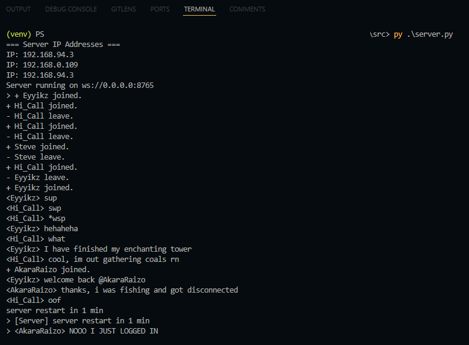

# Weird ahh Minecraft WebSocket Program

A web-based Local Area Network (LAN) application based on the video game [Minecraft](https://minecraft.net). A simple game where the server will listen to clients that connects through a web browser whilst being connected to the same network as the server.

HTML, CSS, JS, Python, and WebSocket-based interaction, players could do all sorts of commands-based action just like in-game multiplayer server.


## Installation
You need at least Python v3 to run this program.
Setup your **virtual environment** if needed:

```bash
py -m venv venv
venv\Script\activate
```

here's the package you have to install:

```bash
pip install websockets asyncio
```

Running **server**:
```bash
cd src/
```
```bash
py server.py
```

Running **client**:
1. Connect to the same local network as the Server.
2. Then, **open the index.html** locally (the file could be anywhere).
3. Enter the username and Server IP (press enter if localhost).
4. Congratulation! You are now connected to the chat server.


**Optional:**
You can install the `Minecraftia` font for the look, but it is not necessary. Put the font into the [style](src/style/) folder. Adjust the format if necessary, and edit the CSS file at `@font-face` syntax.


## Chat Example
Cliet 1 (Eyyikz):


Client 2 (Hi_Call):


Client 3 (AkaraRaizo):


Server:



## QnA
- Q: How to create more clients?
- A: Just open the index.html file into a new tab, it'll create a client automatically and will join the broadcast group.

## Credits
The idea is initiated by the introduction of the `"Socket Programming with Python"` by _Rikih Gunawan_ e-book. It's a relatively old book that teaches us how exactly computers communicate using different _"languages"_ such as UDP, TCP, FTP, and more.

Special thanks to **INDxdmanik**, **Hi_Call**, and **AkaraRaizo** for willingly to catch strays.

The font used in this program is `Minecraftia`, but i will not redistribute it under the free-for-personal-use license. You may get it from online distributor such as [Dafont](https://dafont.com).

**Creators:**
- [NotRez a.k.a Rezdblz](https://github.com/Rezdblz)
- [Quackeyikz a.k.a Eyyikz](https://github.com/Quackeyikz)