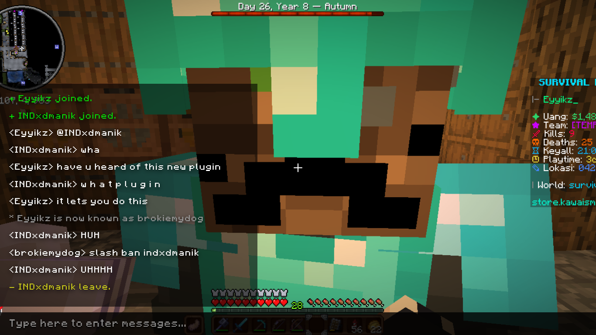

# Weird ahh Minecraft WebSocket Program

A web-based Local Area Network (LAN) application based on the video game [Minecraft](https://minecraft.net). A simple game where the server will listen to clients that connects through a web browser whilst being connected to the same network as the server.

HTML + WebSocket based interaction, players could do all sorts of commands-based action just like in-game multiplayer server.



## Installation
You need at least Python v3 to run this program.
Setup your venv if needed, here's the package you have to install:

```bash
pip install websockets
```
```bash
pip install asyncio
```

Running the program:
```bash
cd src/
```
```bash
py server.py
```
Then, **open the index.html** locally.

**Optional:**
You can install the Minecraftia font for the look, but it is not necessary. Put the font into the [style](src/style/) folder. Adjust the format if necessary, and edit the CSS file at `@font-face` syntax.


## QnA
- Q: How to create more clients?
  A: Just open the index.html file into a new tab, it'll create a client automatically and will join the broadcast group.

## Credits
The idea is initiated by the introduction of the [_"Socket Programming with Python"_ by _Rikih Gunawan_](/rikih-socket_python.pdf) e-book. It's a relatively old book that teaches us how exactly computers communicate using different _"languages"_ such as UDP, TCP, FTP, and more.

Special thanks to INDxdmanik for willingly to catch strays.

The font used in this program is Minecraftia, but i will not redistribute it under the free-for-personal-use license. You may get it

**Creators:**
- [NotRez | Rezdblz](https://github.com/Rezdblz)
- [Quackeyikz](https://github.com/Quackeyikz)